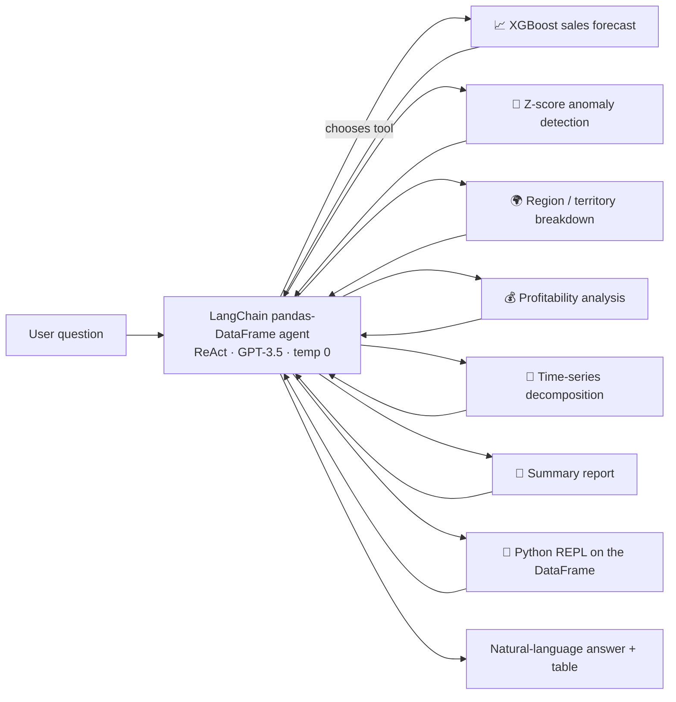

# 📊 LLM-Powered Sales Analytics Agent (LangChain + OpenAI)


> Ask business questions about sales data **in plain English** — *"Forecast sales for Motorcycles"*, *"Detect anomalies"*, *"Which product line is most profitable?"* — and an LLM agent decides which analytics tool to run and explains the result.

---

## 📌 Why

Business users often need quick answers from data but depend on analysts to write queries. This project combines an **LLM's reasoning** with **reliable, pre-built analytics functions**, so the LLM doesn't guess numbers — it **calls tools** that compute them.

## 🏗️ Architecture



**Stage 1 – Data engineering** (Kaggle *Sample Sales Data*, 2,823 order lines):
merged address fields, built `location`, filled missing `territory` from a country → region map, parsed dates, normalised column names and removed duplicates, then explored trends with Seaborn/Plotly.

**Stage 2 – Agent:** a `create_pandas_dataframe_agent` (zero-shot ReAct) with **six custom tools**, each wrapped with input validation and error handling, plus file-backed conversation memory.

## 🧪 Example Interactions (from the notebook)

| Question | Tool used | Answer (abridged) |
|---|---|---|
| *Forecast sales for the Motorcycles product line* | XGBoost forecaster | 6-month forecast table |
| *Detect any anomalies in the sales data* | Z-score detector | 1 anomaly — 2005-03-03, $10,066.6, z = 3.83 |
| *Show me the sales breakdown for NA* | Region breakdown | Total / mean / median sales by city |
| *Generate a summary report* | Report generator | $10.03 M total sales · 92 customers · 7 product lines · top territory EMEA |
| *Least selling product?* | Python REPL | **Trains** ($226 K) |

## 💡 Lessons Learned (honest notes)

- **Tool descriptions are the real prompt.** The agent once answered *"top selling product"* using the *profitability* tool — tighter tool descriptions are needed to route correctly.
- Tools must **fail gracefully**: the forecaster reports when there is too little history to compute error metrics; the decomposition tool surfaced a file-path error instead of crashing the agent.
- Deterministic Python tools + LLM orchestration is far more trustworthy than asking an LLM to do arithmetic.

## 🔭 Next Steps

- Add a Streamlit chat UI and deploy it.
- Evaluate tool-selection accuracy on a fixed question set.
- Migrate to LangGraph / tool-calling models for more reliable routing.

## 🚀 How to Run

```bash
git clone https://github.com/AnishRane-cox/LLM-AI-Analytic-Project.git
cd LLM-AI-Analytic-Project
pip install openai langchain langchain-experimental langchain-openai langchain-community xgboost statsmodels pandas seaborn plotly kaggle tabulate
export OPENAI_API_KEY="your-openai-key"
jupyter notebook "LLM_–_Powered_Data_Analytics_Agent.ipynb"
```

Download the dataset with `kaggle datasets download -d kyanyoga/sample-sales-data` (needs a Kaggle API key), or place `sales_data_sample.csv` next to the notebook. The notebook was built in Colab — adjust the Drive paths if running locally.

> ⚠️ The pandas agent executes model-generated Python (`allow_dangerous_code=True`). Run it only in a sandboxed environment.

## 📁 Repository Structure

```
├── LLM_–_Powered_Data_Analytics_Agent.ipynb      # Data prep + agent + tests
├── LLM_–_Powered_Data_Analytics_Agent_DOC.pdf    # Project documentation
├── LICENSE
└── README.md
```

---

## 👤 Author

**Anish Rane** — Data & AI Engineer · MSc Machine Learning & AI (LJMU) · Mechanical Engineer

[](https://anishrane-cox.github.io/Portfolio/)
[](https://www.linkedin.com/in/anish-rane/)
[](https://github.com/AnishRane-cox)

⭐ If you found this useful, consider starring the repo.
